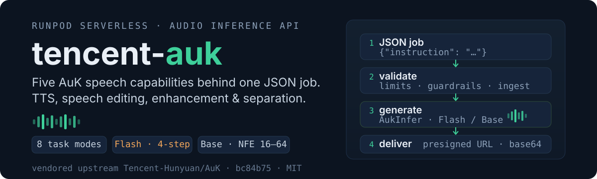
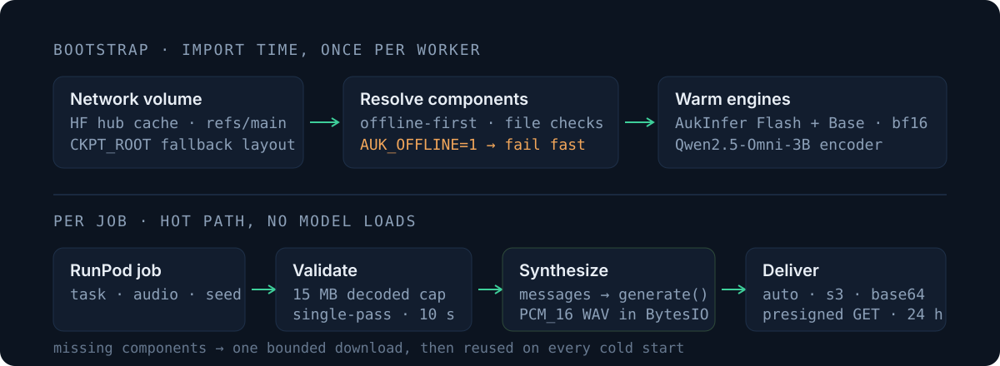

<p align="center">
  
</p>

# tencent-auk

A RunPod Serverless worker for [Tencent AuK](https://github.com/Tencent-Hunyuan/AuK) (Audio Swiss Knife): one
JSON job in, speech audio out. Eight task modes cover zero-shot voice cloning, instruct TTS, speech content
editing, acoustic editing, paralinguistic editing, and audio enhancement/separation — served by a warm,
in-memory engine with dual model variants (**AuK-Flash**, a fixed 4-step distilled DiT, and **AuK-Base**, a
flow-matching DiT) and delivered as inline base64 or a presigned B2/S3 URL.

## Quick start

**1. Deploy.** RunPod builds the image from this repo's `Dockerfile`. Before the first deploy:

- Attach a **network volume** to the endpoint.
- Enable **native model caching** for all three model repos — `tencent/AuK`, `tencent/AuK-Flash`, and
  `Qwen/Qwen2.5-Omni-3B` — so RunPod pre-downloads them into the volume before the worker starts.
- Set the runtime secrets `AWS_ACCESS_KEY_ID` / `AWS_SECRET_ACCESS_KEY` as endpoint environment variables
  (never baked into the image).

**2. Call it.** RunPod exposes the serverless API at `https://api.runpod.ai/v2/<endpoint-id>`:

```bash
curl -X POST "https://api.runpod.ai/v2/<endpoint-id>/runsync" \
  -H "Authorization: Bearer $RUNPOD_API_KEY" \
  -H "Content-Type: application/json" \
  -d '{
    "input": {
      "task": "instruct_tts",
      "instruction": "Based on the following description: \"A warm, professional narrator with a medium pace.\", generate speech content \"RunPod serverless is up and running.\".",
      "gen_seconds": 2.5
    }
  }'
```

AuK has **no separate text field** — the words to speak travel inside `instruction` using the upstream cookbook
templates: instruct TTS is `Based on the following description: "…", generate speech content "…".` and zero-shot
is `Say the following with the same voice: "…".`

**3. Get audio.** With credentials configured, `auto` delivery uploads to B2/S3 and returns a presigned URL;
without credentials it falls back to inline base64 WAV (`size_bytes`, `duration_seconds`, `sample_rate`, and the
effective `nfe` ride along as metadata). Prefer S3 for anything longer than a few seconds — RunPod's result
gateway rejects very large inline payloads.

### Cold starts & `/runsync`

The first job after a worker spawn waits through model loading (~90 s measured), and RunPod's default `/runsync`
wait is **also 90 s** — so a cold start lands right on the boundary. When the wait expires the gateway returns
`IN_PROGRESS`, and the worker's later delivery to that expired sync record is rejected, so the job ends up
reporting completed with **no output**. For the first job after any cold boot, either raise the window with
`?wait=300000` (the documented range is 1000–300000 ms) or use `/run` + `/status/:id`; a warm worker answers
`/runsync` with no options needed.

## Endpoints

The worker registers **one** RunPod handler; the platform routes below are provisioned automatically for every
serverless endpoint at `https://api.runpod.ai/v2/<endpoint-id>`:

| Method | Path | Purpose |
|--------|------|---------|
| `POST` | `/run` | queue a job (async; returns `id` + status) |
| `POST` | `/runsync` | queue and block until the result is ready |
| `GET` | `/status/:id` | poll a job's status / fetch its result |
| `POST` | `/cancel/:id` | cancel a queued or running job |
| `POST` | `/retry/:id` | requeue a `FAILED` or `TIMED_OUT` job, same id and input |
| `GET` | `/health` | worker + job counters (see the RunPod operation reference) |

There are no worker-internal HTTP routes — the entire API surface is the `input` dict of the job payload.
`/stream` and `/purge-queue` also exist but are unused here: the worker is not a streaming handler, and purging
affects every caller on the endpoint.

Results expire — **1 minute after completion for `/runsync`, 30 minutes for `/run`** — so fetch promptly, or the
job can no longer be retried.

## The job contract (`input`)

Fail-fast validation with a closed error set; first failing rule wins.

| Field | Type | Default | Notes |
|-------|------|---------|-------|
| `task` | string | `"auto"` | one of the 8 modes; see matrix below |
| `instruction` | string | — | **required** — natural-language directive |
| `audio` | string | — | source clip for edit/enhance/separate; base64 or `http(s)://` URL |
| `prompt_audio` | string | — | zero-shot reference clip; base64 or URL |
| `prompt_text` | string | — | exact transcript of `prompt_audio`; valid only alongside it |
| `gen_seconds` | number | heuristic | `0.5..300.0`; or text via `gen_text` heuristic |
| `gen_text` | string | — | text feeding the duration heuristic |
| `model_variant` | string | `DEFAULT_MODEL_VARIANT` | `flash` \| `base` |
| `nfe` | int | 4 (flash) / 32 (base) | flash accepts `1..8`; base `16..64` |
| `cfg_scale` | number | 0.0 (flash) / 2.0 (base) | forced to `0.0` for flash; base `1.0..5.0` |
| `seed` | int | — | ≥ 0; forwarded for reproducibility |
| `response_delivery` | string | `"auto"` | `auto` \| `s3` \| `base64`; `auto` prefers presigned S3 when credentials are configured (RunPod rejects very large inline results), else base64 |

Audio fields accept base64 (optionally `data:audio/…;base64,`-prefixed) or `http(s)://` URLs. Each clip is
decoded **exactly once**; the 15 MB cap applies to decoded bytes; URL ingest streams with a 10 s timeout.

## Task modes

| Task | `instruction` | `audio` | `prompt_audio` | `prompt_text` | What it does |
|------|:---:|:---:|:---:|:---:|------|
| `zero_shot_tts` | required | forbidden | **required** | optional | clone a voice from a reference clip |
| `instruct_tts` | required | forbidden | forbidden | forbidden | voice design from the instruction alone |
| `content_edit` | required | **required** | forbidden | forbidden | word replace / insert / delete, lyric swap |
| `acoustic_edit` | required | **required** | forbidden | forbidden | semitone pitch, speed scale, dB volume |
| `paralinguistic_edit` | required | **required** | forbidden | forbidden | emotion, timbre, de-accent, whisper, nonverbal cues |
| `enhancement` | required | **required** | forbidden | forbidden | denoise, dereverb |
| `separation` | required | **required** | forbidden | forbidden | multi-speaker / singing extraction, target-speaker extraction |
| `auto` | required | resolver | resolver | resolver | see below |

**`task: "auto"` resolution** — explicit task wins; otherwise `prompt_audio` → `zero_shot_tts`; neither audio
field → `instruct_tts`; bare `audio` → `invalid_payload` (edit intents are indistinguishable — the worker
refuses to guess).

## Responses

The worker returns **one flat object**. RunPod wraps it in the job envelope under `output`, so a client always
reads `job.output.*`:

```json
{
  "id": "a5a102c6-…-u2",
  "status": "COMPLETED",
  "delayTime": 125,
  "executionTime": 1595,
  "output": {
    "delivery": "s3",
    "audio_url": "https://s3.us-west-004.backblazeb2.com/Tencent-AuK/…?X-Amz-Signature=…",
    "bucket": "Tencent-AuK",
    "key": "AuK2026/09/12/a5a102c6-…-b98f49f1-….wav",
    "size_bytes": 48044,
    "duration_seconds": 1,
    "sample_rate": 24000,
    "model_variant": "flash",
    "nfe": 4,
    "task_executed": "instruct_tts",
    "url_expires_in": 86400,
    "url_expires_at": "2026-09-13T01:06:05Z"
  }
}
```

`sample_rate` is the rate the model actually returns per request (24 kHz in production; the test mock agrees).

**Base64** — `delivery="base64"`, plus `audio_base64` and `size_bytes`. Only safe for short clips: RunPod caps
the response payload at **10 MB on `/run`** and **20 MB on `/runsync`** (RunPod operation reference), and
exceeding it fails the delivery silently — the job reports `COMPLETED` with no `output`. A 24 kHz mono 16-bit
WAV is ~48 KB/s, so base64 (~4/3×) reaches 10 MB at roughly 160 s of audio. Prefer S3.

**S3** — `delivery="s3"`, plus `audio_url`, `bucket`, `key`, `size_bytes`, `url_expires_in`, `url_expires_at`.
`audio_url` is a presigned GET, valid for `url_expires_in` seconds (default 24 h) — download or play it before
then. Keys follow `{prefix}{YYYY}/{MM}/{DD}/{sanitized_job_id}-{uuid4}.wav`, where the prefix is concatenated
**verbatim with no separator**: `auk/` yields `auk/2026/…`, but `AuK` yields `AuK2026/…`. `auto` picks this
whenever credentials are configured.

### Failures — read the error as a JSON *string*

A failed job reports `status: "FAILED"`. **`error` is a JSON string, not an object** — this is a RunPod platform
requirement, not a worker choice. `runpod-python` hoists any top-level `error` off the handler's return value
into the job's own error field, and the job-done gateway rejects a non-string there with `400 Bad Request`
(runpod-python#309). The worker therefore serializes its structured envelope into a string at the wire boundary:

```json
{
  "id": "…",
  "status": "FAILED",
  "error": "{\"code\": \"missing_required_field\", \"message\": \"instruction is required\", \"field\": \"instruction\"}"
}
```

**Parse it:**

```js
const detail = typeof job.error === "string" ? JSON.parse(job.error) : job.error;
// detail.code, detail.message, detail.field (field is optional)
```

Do not write `job.error.code` — it is `undefined`. The structured `code`/`message`/`field` survive verbatim
inside the string, so nothing is lost; it only needs one `JSON.parse`.

Error codes (closed set): `invalid_payload` · `missing_required_field` · `invalid_base64` · `audio_too_large` ·
`audio_download_failed` · `unsupported_model_variant` · `inference_failed` · `s3_credentials_missing` ·
`delivery_failed`.

Messages are safe to display: the engine and storage interpolate only the exception's **type name**, never its
own text, and credentials travel as masked `Secret` objects. No error ever carries audio bytes, a presigned URL,
or credential material.

A job can also come back `COMPLETED` with **no `output`** if the result could not be delivered to RunPod at all
(for example the `/runsync` window expired mid-job — see **Cold starts & `/runsync`**). Treat "completed but no `output`" as a
failure and retry rather than reading fields off it.

## Calling it from a front end

**The RunPod API key must never reach the browser.** Every request authenticates with
`Authorization: Bearer <RUNPOD_API_KEY>`, and an endpoint id + key pair can spend your GPU minutes — shipping
it in client-side code exposes it to anyone who opens devtools. Route browser calls through a small backend you
control:

```
browser  ──POST /api/tts──▶  your backend  ──Bearer key──▶  api.runpod.ai/v2/<endpoint-id>
         ◀──{ audioUrl }──                ◀──job JSON──
```

The backend additionally lets you hold the API key server-side, rate-limit callers, and swap the endpoint id
without a front-end redeploy.

**Prefer async `/run` + poll for anything user-facing.** `/runsync` holds the connection open, so a cold start
(~90 s, see below) blocks it and can time out. `/run` returns an id immediately, which suits a loading state:

```js
// backend
const r = await fetch(`https://api.runpod.ai/v2/${ENDPOINT}/run`, {
  method: "POST",
  headers: { Authorization: `Bearer ${RUNPOD_API_KEY}`, "Content-Type": "application/json" },
  body: JSON.stringify({ input: { task: "instruct_tts", instruction, gen_seconds: 2.5 } }),
});
const { id } = await r.json();

// Non-terminal: IN_QUEUE | IN_PROGRESS | RUNNING. Terminal: COMPLETED | FAILED | CANCELLED | TIMED_OUT
// Loop on the non-terminal set rather than assuming the terminal list is exhaustive.
const PENDING = ["IN_QUEUE", "IN_PROGRESS", "RUNNING"];
while (true) {
  const job = await (await fetch(`https://api.runpod.ai/v2/${ENDPOINT}/status/${id}`, {
    headers: { Authorization: `Bearer ${RUNPOD_API_KEY}` },
  })).json();

  if (job.status === "COMPLETED") {
    // Terminal, but `output` is absent if delivery to RunPod was lost — do not read fields off it.
    return job.output ? { ok: true, ...job.output } : { ok: false, code: "no_output" };
  }
  if (!PENDING.includes(job.status)) {                       // FAILED | CANCELLED | TIMED_OUT
    const detail = typeof job.error === "string" ? JSON.parse(job.error) : job.error;
    return { ok: false, code: job.status, ...detail };
  }
  await new Promise((res) => setTimeout(res, 1000));   // back off in production
}
```

**Playing the result.** Both delivery modes produce something an `<audio>` element can use directly:

```js
// `result` is the flattened success object from the poll above ({ ok: true, ...job.output })

// S3 (the default whenever credentials are configured) — presigned, valid ~24 h
audioEl.src = result.audio_url;

// base64 fallback — wrap the bytes in a Blob
const bytes = Uint8Array.from(atob(result.audio_base64), (c) => c.charCodeAt(0));
audioEl.src = URL.createObjectURL(new Blob([bytes], { type: "audio/wav" }));
```

`audio_url` expires (`url_expires_at` is an ISO-8601 UTC timestamp). Download or cache the audio if the user
might replay it long after the request — or ask for `response_delivery: "base64"` when the clip is short.

**Design the UI for a cold start.** A freshly booted worker loads models before the first job (~90 s measured,
against RunPod's 90 s default `/runsync` wait — see **Cold starts**). A warm worker returned a 1-second clip in
1.6 s execution time. Either keep a worker warm (`workers_min: 1`) or show honest progress rather than a spinner
that looks hung. Sending `"response_delivery": "s3"` is worthwhile for any clip beyond a few seconds.

**Check which variants your pool can serve before exposing a choice.** A 24 GB pool keeps only the default
variant; asking for the other one builds a model that does not fit and returns `inference_failed`. Read
`loaded=[…]` from the worker's startup log once per pool, and either omit `model_variant` or offer only the
resident one. Omitting it is always safe — the worker falls back to `DEFAULT_MODEL_VARIANT`.

## Environmental variables

Values are the defaults the worker runs with. All except `AUK_ENCODER_BF16` and `AUK_TEST_MOCK_ENGINE` are baked
into the image (`Dockerfile` `ENV`); those two are code defaults in `engine.py`, so setting them means adding a
variable the image does not define. Override any of them per deployment via RunPod endpoint environment
variables. The two credential variables are **runtime-only** — never baked into the image.

### Engine & checkpoints

| Variable | Default | Purpose |
|----------|---------|---------|
| `DEFAULT_MODEL_VARIANT` | `flash` | variant loaded first; the other loads lazily |
| `CKPT_ROOT` | `/runpod-volume/ckpts` | designated checkpoint layout, tier 2 of resolution |
| `HF_HUB_CACHE` | `/runpod-volume/huggingface-cache/hub` | native RunPod model-cache location, tier 1 |
| `HF_HUB_OFFLINE` | `1` | parent inference process never talks to the Hub |
| `TRANSFORMERS_OFFLINE` | `1` | transformers likewise resolves locally only |
| `AUK_OFFLINE` | `0` | `1` forbids the download fallback entirely (fail fast) |
| `RUNPOD_INIT_TIMEOUT` | `1200` | platform init budget; downloads bounded to `min(900, this − 300)` s |
| `AUK_ENCODER_BF16` | `1` | `0` keeps upstream's fp32 encoder weights (see **How it works → Variants**); set only when output must be byte-comparable to the unmodified baseline |
| `PYTORCH_CUDA_ALLOC_CONF` | `expandable_segments:True` | allocator fragmentation headroom. Note the spelling is version-specific — torch 2.8 uses `PYTORCH_CUDA_ALLOC_CONF`; `PYTORCH_ALLOC_CONF` is a later rename and is a silent no-op here |

### Platform / process

| Variable | Default | Purpose |
|----------|---------|---------|
| `RUNPOD_LOG_LEVEL` | `INFO` | SDK log level |
| `PYTHONUNBUFFERED` | `1` | unbuffered stdout (crash dumps, health logs) |
| `PYTHONDONTWRITEBYTECODE` | `1` | no `.pyc` writes in the container |

### Storage & delivery

| Variable | Default | Purpose |
|----------|---------|---------|
| `AUDIO_DELIVERY` | `auto` | deployment default; `auto` without S3 creds → base64 |
| `S3_ENDPOINT_URL` | `https://s3.us-west-004.backblazeb2.com` | B2 S3-compatible endpoint |
| `S3_BUCKET` | `auk-audio-production` | delivery bucket (placeholder — override per environment) |
| `S3_REGION` | `us-west-004` | B2 region |
| `S3_KEY_PREFIX` | `auk/` | key prefix |
| `S3_PRESIGN_EXPIRY_SECONDS` | `86400` | presigned GET lifetime (24 h) |
| `S3_ADDRESSING_STYLE` | `path` | B2 requires path-style |
| `AWS_ACCESS_KEY_ID` | — | **runtime secret** — endpoint env only |
| `AWS_SECRET_ACCESS_KEY` | — | **runtime secret** — endpoint env only |

### Development / test

| Variable | Default | Purpose |
|----------|---------|---------|
| `AUK_TEST_MOCK_ENGINE` | — | `1` swaps the engine for a stdlib-only mock: no GPU, no torch, no `auk`, no network |

## How it works

<p align="center">
  
</p>

**Bootstrap (import time, once).** The engine resolves all three components — `tencent/AuK`, `tencent/AuK-Flash`,
`Qwen/Qwen2.5-Omni-3B` — offline-first from the native cache: `refs/main` → snapshot, falling back to the first
complete snapshot in sorted order. Complete-file checks (including every shard in the safetensors index) reject
partial downloads. A complete `CKPT_ROOT` directory is reused next; only then may a missing component use one
bounded `snapshot_download(..., local_dir=...)` into the designated location. `AUK_OFFLINE=1` forbids that
fallback. The inference process itself never talks to the network — downloads run in a bounded bootstrap child.

**Per job (hot path).** Fail-fast validation → the already-decoded clip (if any) is written to one temp file →
cookbook-style messages with the optional transcript carried as labeled reference text → `generate(messages,
gen_seconds, nfe, cfg_strength, seed)` → the returned `(waveform, sample_rate)` is serialized as mono 16-bit PCM
WAV in memory → delivery. Temp files are removed in `finally`; the handler never dies from a malformed job.

**Variants.** AuK-Flash runs its distilled recipe — exactly 4 steps, CFG 0.0 — regardless of the accepted input
range `1..8`; metadata reports the effective `nfe=4`. AuK-Base honors `nfe` 16..64 (default 32) and `cfg_scale`
1.0..5.0 (default 2.0).

**GPU sizing.** Measured on an RTX PRO 6000 and confirmed on a 23.5 GiB RTX 4090 (flash):

```
# RTX PRO 6000 — historical measurement with both variants resident (no longer attempted)
vram before generate … free=59.1 of 95.0 GiB | torch_alloc=27.6 peak=27.6 GiB
vram after  generate … free=59.0 of 95.0 GiB | torch_alloc=28.1 peak=30.5 GiB

# RTX 4090, flash only — job succeeded
vram after 'flash' build: free= 9.2 of 23.5 GiB | torch_alloc=13.8 peak=21.3 GiB
vram after  generate   : free= 6.3 of 23.5 GiB | torch_alloc=14.2 peak=16.7 GiB
```

So each resident variant costs **~13.8 GiB** — every `AukInfer` owns its own encoder + VAE + DiT — plus a
**~2.9 GiB** per-job working set. Placement is therefore **single-resident**: exactly one model lives in VRAM.
The default variant loads eagerly at startup; a job asking for the other evicts it first (drop the handle,
`empty_cache()`, rebuild — a full model load from the volume cache). Stacking both needs ~43 GiB (the 96 GiB
probe above once measured 42.7 GiB with both resident) and OOMs a 32 GiB card, so the worker never stacks them.

| Card | One variant + job (~16.7 GiB) |
|------|:---:|
| 24 GB class (RTX 4090, 23.5 GiB) | **yes — 6.3 GiB spare, verified** |
| 32 GB class (RTX 5090) | yes |
| 48 GB class (A40 / L40S) | yes |
| 80 GB class (A100) | yes |
| 96 GB (RTX PRO 6000) | yes |

**On a single-variant pool, only the resident variant is usable.** A 24 GB card keeps `flash` and skips `base`;
a request with `"model_variant": "base"` then tries to build that model on demand, does not fit, and fails with
a structured `inference_failed`. Don't offer a variant picker on such a pool — omit `model_variant` (it defaults
to `DEFAULT_MODEL_VARIANT`) or pin it to the resident one. The startup log line names what is loaded:

```
[auk-engine] real mode — … default_variant=flash, loaded=['flash']
```

These figures already include an encoder fix: upstream loads the Qwen text encoder in bf16 and then casts the
whole model — encoder included — to fp32, so the worker returns the encoder to bf16 at startup (opt out with
`AUK_ENCODER_BF16=0`). That is what brought the per-variant cost down from ~21.4 GiB, and it is why a 24 GB card
works at all: at 21.4 GiB the model plus a job needed ~24.3 GiB and OOM'd. Note the downcast strands the old
fp32 blocks in torch's caching allocator, so the worker flushes the cache immediately after; **if you remove or
reorder that flush, expect the freed memory not to reach the driver** — measured at 8.3 GiB stranded on a run
without it, against 0.5 GiB with it.

Treat these numbers as a starting point, not a guarantee: read the `[auk-engine] vram` lines from your own
deploy before sizing a pool.

## Development

```bash
AUK_TEST_MOCK_ENGINE=1 python3 -m pytest -v tests/   # 163 tests, stdlib-only, no GPU/network
AUK_TEST_MOCK_ENGINE=1 python3 handler.py --test_input '{"input": {"instruction": "hello"}}'
```

- **Vendored upstream**: complete clean export of [Tencent-Hunyuan/AuK](https://github.com/Tencent-Hunyuan/AuK)
  at `bc84b758c7566dfce9bef0c49fba443456093b40` (MIT) under `src/` — imported by the built image, never edited.
  API: `from auk.infer.infer_auk import AukInfer, save_audio`.
- **Torch note**: the image pins torch 2.8.0 / torchvision 0.23.0 / torchaudio 2.8.0 (cu128) — a recorded
  deviation from upstream's declared `torch>=2.7,<2.8`, so the vendored package installs `--no-deps` with its
  remaining inference deps owned by `requirements.txt`. No flash-attention wheel: inference pins
  `attn_backend="torch"`.
- **Where the contracts live**: the behavioral contracts (payload shapes, error codes, placement policy,
  storage field sets) are pinned in a local Interpretable-Context-Methodology workspace under `.icm/`. That tree
  is **not committed** — it is development context, not repository or image content — so a fresh clone will not
  contain it. In a clone, the authoritative sources are the code, `tests/`, and this README.

## License

The vendored upstream AuK code is MIT-licensed (retained in `src/LICENSE`). This repository does not yet carry a
separate license file for the worker code.
