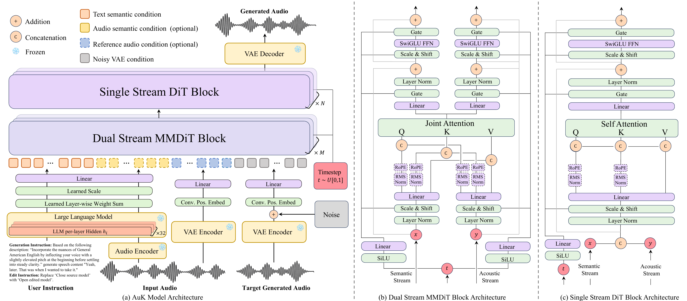

<div align="center">

# AuK: An Open-Source Foundational Model for Speech Generation and Editing

</div>

<div align="center">
  <a href=https://auk-project.github.io/ target="_blank"></a>
  <a href=https://arxiv.org/abs/2609.08936 target="_blank"></a>
  <a href=https://huggingface.co/spaces/tencent/AuK target="_blank"></a>
  <a href=https://modelscope.cn/studios/Tencent-Hunyuan/AuK target="_blank"></a>
</div>

<p align="center">
💻 Try our model on the <a href="https://huggingface.co/spaces/tencent/AuK">HuggingFace Space</a> · <a href="https://modelscope.cn/studios/Tencent-Hunyuan/AuK">ModelScope Space</a>!
</p>

## News

- **[2026/09/09]** 🙌 Thanks to **SGLang-Omni** for Day 0 support for **AuK** and **AuK-Flash**! Check out the [SGLang-Omni cookbook](https://sgl-project.github.io/sglang-omni/cookbook/auk.html) to get started.
- **[2026/09/09]** 🎉 We open-source **AuK**. Code and model weights are publicly available. Try it on the [🤗 Demo Space](https://huggingface.co/spaces/tencent/AuK) or the [🤖 ModelScope Space](https://modelscope.cn/studios/Tencent-Hunyuan/AuK)!

### Demo

<details open>
<summary>English</summary>

https://github.com/user-attachments/assets/d07332fc-5f69-4f16-9d00-a7443cc19e6a

</details>

<details>
<summary>中文</summary>

https://github.com/user-attachments/assets/c532bbdb-e6ce-4434-a9a5-16f29a8d4135

</details>

## Contents

- [News](#news)
- [Introduction](#introduction)
- [Performance](#performance)
- [Model Architecture](#model-architecture)
- [Supported Tasks](#supported-tasks)
- [Quick Start](#quick-start)
  - [Installation](#installation)
    - [uv](#uv)
    - [Conda](#conda)
  - [Download the weights](#download-the-weights)
  - [Command-line inference](#command-line-inference)
  - [Interactive Gradio demo](#interactive-gradio-demo)
  - [ComfyUI](#comfyui)
  - [Prompt Enhancer](#prompt-enhancer)
  - [Python API](#python-api)
- [Fine-tuning](#fine-tuning)
- [Contributing](#contributing)
- [Citation](#citation)
- [License](#license)

## Introduction

**AuK** is a 1.5B foundation model for speech generation and editing. Trained on millions of hours of diverse audio data, AuK supports zero-shot and
instruction-based TTS, content and acoustic editing, paralinguistic editing,
speech enhancement, and source separation through a unified natural-language
instruction interface. AuK has two variants:

| Model | Description | Weight |
| --- | --- | --- |
| AuK | Base model for high-quality generation | 🤗 [Hugging Face](https://huggingface.co/tencent/AuK) · 🤖 [ModelScope](https://modelscope.cn/models/Tencent-Hunyuan/AuK) |
| AuK-Flash | Distilled model for fast 4-step inference | 🤗 [Hugging Face](https://huggingface.co/tencent/AuK-Flash) · 🤖 [ModelScope](https://modelscope.cn/models/Tencent-Hunyuan/AuK-Flash) |

## Performance


## Model Architecture



## Supported Tasks

AuK exposes every task through the same natural-language instruction interface. The table below groups the supported tasks by category, with a short description and a link to its section in the [Cookbook](docs/COOKBOOK.md), where you'll find instruction templates plus CLI and Python examples.

<table>
  <thead>
    <tr>
      <th>Category</th>
      <th>Task</th>
      <th>Description</th>
      <th>Cookbook</th>
    </tr>
  </thead>
  <tbody>
    <tr>
      <td rowspan="2">Speech Generation</td>
      <td>Zero-shot TTS</td>
      <td>Speak the target text in the voice of the reference audio.</td>
      <td><a href="docs/COOKBOOK.md#11-zero-shot-tts">Zero-shot TTS</a></td>
    </tr>
    <tr>
      <td>Instruct TTS</td>
      <td>Generate speech from a voice description alone — no reference audio.</td>
      <td><a href="docs/COOKBOOK.md#12-instruct-tts">Instruct TTS</a></td>
    </tr>
    <tr>
      <td rowspan="2">Content Editing</td>
      <td>Speech Content Editing</td>
      <td>Rewrite <em>what is said</em> — replace, insert, or remove text.</td>
      <td><a href="docs/COOKBOOK.md#21-speech-content-editing">Speech Content Editing</a></td>
    </tr>
    <tr>
      <td>Lyric Editing</td>
      <td>Rewrite lyrics in a singing recording while preserving the melody and voice.</td>
      <td><a href="docs/COOKBOOK.md#22-lyric-editing">Lyric Editing</a></td>
    </tr>
    <tr>
      <td rowspan="3">Acoustic Editing</td>
      <td>Pitch Editing</td>
      <td>Raise or lower the pitch by semitones.</td>
      <td><a href="docs/COOKBOOK.md#31-pitch-editing">Pitch Editing</a></td>
    </tr>
    <tr>
      <td>Speed Editing</td>
      <td>Adjust the speaking rate; output length scales with the speed factor.</td>
      <td><a href="docs/COOKBOOK.md#32-speed-editing">Speed Editing</a></td>
    </tr>
    <tr>
      <td>Volume Editing</td>
      <td>Raise or lower the volume by decibels.</td>
      <td><a href="docs/COOKBOOK.md#33-volume-editing">Volume Editing</a></td>
    </tr>
    <tr>
      <td rowspan="5">Paralinguistic Editing</td>
      <td>Emotion</td>
      <td>Change the emotion while preserving content and voice.</td>
      <td><a href="docs/COOKBOOK.md#41-emotion">Emotion</a></td>
    </tr>
    <tr>
      <td>Timbre</td>
      <td>Change the timbre to a description while keeping the content unchanged.</td>
      <td><a href="docs/COOKBOOK.md#42-timbre">Timbre</a></td>
    </tr>
    <tr>
      <td>De-accent</td>
      <td>Remove a regional accent while preserving the speaker's voice and content.</td>
      <td><a href="docs/COOKBOOK.md#43-de-accent">De-accent</a></td>
    </tr>
    <tr>
      <td>Nonverbal Editing</td>
      <td>Remove or add nonverbal sounds such as breaths, laughs, or coughs.</td>
      <td><a href="docs/COOKBOOK.md#44-nonverbal-editing">Nonverbal Editing</a></td>
    </tr>
    <tr>
      <td>Whisper Conversion</td>
      <td>Convert between normal speech and whisper while preserving speaker and content.</td>
      <td><a href="docs/COOKBOOK.md#45-whisper-conversion">Whisper Conversion</a></td>
    </tr>
    <tr>
      <td rowspan="4">Enhancement &amp; Separation</td>
      <td>Speech Enhancement</td>
      <td>Denoise, dereverberate, or restore natural, clear speech.</td>
      <td><a href="docs/COOKBOOK.md#51-speech-enhancement">Speech Enhancement</a></td>
    </tr>
    <tr>
      <td>Speech Separation</td>
      <td>Keep one speaker by talking order and remove the others.</td>
      <td><a href="docs/COOKBOOK.md#52-speech-separation">Speech Separation</a></td>
    </tr>
    <tr>
      <td>Music Separation</td>
      <td>Extract the singing voice from a mix, or keep all human voices.</td>
      <td><a href="docs/COOKBOOK.md#53-music-separation">Music Separation</a></td>
    </tr>
    <tr>
      <td>Target Speaker Extraction</td>
      <td>Keep the target speaker identified by <em>what they say</em>.</td>
      <td><a href="docs/COOKBOOK.md#54-target-speaker-extraction">Target Speaker Extraction</a></td>
    </tr>
  </tbody>
</table>

## Quick Start

### Installation

Clone the repository, then choose either **uv** or **Conda** to create an
isolated Python 3.10 environment.

```bash
git clone https://github.com/Tencent-Hunyuan/AuK
cd AuK
```

#### uv

```bash
# Create and activate a project-local environment.
uv venv --python 3.10
source .venv/bin/activate

# Choose one installation target:
# Core inference and CLI only
uv pip install -e .

# Core inference + Gradio + Prompt Enhancer + ASR
uv pip install -e ".[gradio]"

# Core inference + ComfyUI nodes + Prompt Enhancer + ASR
uv pip install -e ".[comfyui]"

# Core inference + fine-tuning
uv pip install -e ".[train]"

# Everything
uv pip install -e ".[gradio,train]"
```

#### Conda

```bash
conda create -n auk python=3.10 -y
conda activate auk

# Choose one installation target:
# Core inference and CLI only
pip install -e .

# Core inference + Gradio + Prompt Enhancer + ASR
pip install -e ".[gradio]"

# Core inference + ComfyUI nodes + Prompt Enhancer + ASR
pip install -e ".[comfyui]"

# Core inference + fine-tuning
pip install -e ".[train]"

# Everything
pip install -e ".[gradio,train]"
```

The default installation includes PyTorch, TorchAudio, and TorchVision. If your
platform requires a specific CPU or CUDA build, install a matching PyTorch stack
for your platform first, then install AuK with either command above.

### Download the weights
**🤗 HuggingFace**

```bash
pip install -U "huggingface_hub[cli]"

# AuK-Base
hf download tencent/AuK --local-dir ./ckpts/AuK

# AuK-Flash (4-step distilled) 
hf download tencent/AuK-Flash --local-dir ./ckpts/AuK-Flash

# MLLM Encoder
hf download Qwen/Qwen2.5-Omni-3B  --local-dir ./ckpts/Qwen2.5-Omni-3B
```

**🤖 ModelScope**

```bash
pip install -U modelscope

# AuK-Base
modelscope download --model Tencent-Hunyuan/AuK --local_dir ./ckpts/AuK

# AuK-Flash (4-step distilled)
modelscope download --model Tencent-Hunyuan/AuK-Flash  --local_dir ./ckpts/AuK-Flash

# MLLM Encoder
modelscope download --model Qwen/Qwen2.5-Omni-3B --local_dir ./ckpts/Qwen2.5-Omni-3B
```

The expected directory structure is:

```text
ckpts/
├── AuK/
├── AuK-Flash/          # optional
└── Qwen2.5-Omni-3B/
```

The model checkpoint contains the diffusion transformer and layer-fusion weights. The MLLM encoder and VAE are loaded from separate files at runtime, so missing `text_encoder.*` keys during checkpoint loading are expected.


### Command-line inference
All tasks use the same message-based interface. An `--instruction` is always required, while source or reference `--audio` is optional depending on the task. The examples below are just a taste — for the full instruction templates and per-task CLI examples, see the [Cookbook](docs/COOKBOOK.md).

> [!TIP]
> When starting from a free-form request, we recommend using
> [Prompt Enhancer](#prompt-enhancer). It prepares the model instruction, target
> duration, and any required audio preprocessing, then prints a ready-to-run
> one-line `auk-infer` command.

**Content editing**

Rewrite what is *said* by describing the change in the instruction:

```bash
auk-infer \
    --audio assets/demo-input-audio/content-edit/content.wav \
    --instruction "Replace 'but accepting what we cannot have' with 'and living well with dreams unmet'." \
    --output out_content_edit.wav \
    --gen_seconds 7.0
```

**Speech enhancement / separation**

Denoising, enhancement, and source separation are the same message-driven call — just say what to keep or remove:

```bash
auk-infer \
    --audio assets/demo-input-audio/vocal-extraction/vocal-1-input.wav \
    --instruction "请将这段音频恢复成纯净人声版本：保留原本所有说话人，并去除其中的噪声和混响，输出等长的纯净语音。" \
    --output out_denoise.wav
```

**Zero-shot TTS**

Write the target text into the instruction, then hint the duration with `--gen_text`
(+ optional `--ref_text`, the reference transcript) or an explicit `--gen_seconds`:

```bash
auk-infer \
    --audio assets/demo-input-audio/zero-shot-tts/ref.wav \
    --instruction "Say the following with the same voice: 'Ladies and gentlemen, it's an honor to have the opportunity to address such a distinguished audience'" \
    --output out_tts.wav \
    --gen_seconds 6.0
```

To use AuK-Flash, set:

```bash
--ckpt ckpts/AuK-Flash/auk_flash.safetensors
```
AuK-Flash use 4 fixed time steps and set CFG=0.

### Interactive Gradio demo

Install the Gradio dependencies with `pip install -e ".[gradio]"` (or the
equivalent `uv pip install` command above) before starting the demo.

Prompt Enhancer requires an OpenAI-compatible LLM:

- LLM: [Tencent Cloud TokenHub](https://console.cloud.tencent.com/tokenhub/models)
- Optional cloud ASR: [Tencent Cloud Recording File Recognition](https://cloud.tencent.com/document/product/1093/37823)

Export the credentials before starting Gradio:

```bash
# Required when Prompt Enhancer is enabled
export LLM_API_KEY="your-llm-api-key"
export LLM_BASE_URL="https://tokenhub.tencentmaas.com/v1"
export LLM_MODEL_NAME="hy3"

# Optional cloud ASR; omit these to use local SenseVoiceSmall
export TENCENTCLOUD_SECRET_ID="your-tencentcloud-secret-id"
export TENCENTCLOUD_SECRET_KEY="your-tencentcloud-secret-key"
export ASR_ENGINE_MODEL_TYPE="16k_zh_en"
```

Alternatively, copy the example file and load it:

```bash
cp .env.example .env
set -a
source ./.env
set +a
```

`LLM_BASE_URL` should be the API root, without `/chat/completions`. For
audio-backed PE tasks, Tencent Cloud recording-file recognition is used when
its credentials are configured; if it is unavailable, AuK automatically
downloads and lazily loads `iic/SenseVoiceSmall` as a CPU fallback. The
`gradio` extra includes both cloud and local ASR dependencies.

Choose the model according to your needs:

- **AuK Base**: higher quality, with configurable NFE and CFG.
- **AuK-Flash**: faster generation with fixed NFE=4 and CFG=0.
- **Both**: exposes a model selector in the web UI.

Recommended full command for loading both models on two GPUs:

```bash
auk-gradio \
  --base_ckpt ckpts/AuK/auk_base.safetensors \
  --flash_ckpt ckpts/AuK-Flash/auk_flash.safetensors \
  --base_config ckpts/AuK/config.yaml \
  --flash_config ckpts/AuK-Flash/config.yaml \
  --qwen_path ckpts/Qwen2.5-Omni-3B \
  --base_device cuda:0 \
  --flash_device cuda:1 \
  --dtype bf16 \
  --host 0.0.0.0 \
  --port 8080 \
  --preload
```

The main options above mean:

- `--base_ckpt` / `--flash_ckpt`: models exposed in the UI.
- `--base_config` / `--flash_config`: optional when `config.yaml` is next to
  its checkpoint.
- `--qwen_path`: shared Qwen2.5-Omni-3B directory. If omitted, the path from
  each model config is used.
- `--base_device` / `--flash_device`: GPU used by each model.
- `--preload`: load models during startup; without it, each model is loaded
  on first use.
- Defaults: `--dtype bf16`, `--host 0.0.0.0`, `--port 7860`.

With the standard directory layout, the shortest command detects every
installed variant under `ckpts/AuK` and `ckpts/AuK-Flash`:

```bash
auk-gradio
```

To expose only one model, pass only its checkpoint:

```bash
# Base only
auk-gradio \
  --base_ckpt ckpts/AuK/auk_base.safetensors \
  --base_device cuda:0

# Flash only
auk-gradio \
  --flash_ckpt ckpts/AuK-Flash/auk_flash.safetensors \
  --flash_device cuda:0
```

To load both models on one GPU:

```bash
auk-gradio \
  --base_device cuda:0 \
  --flash_device cuda:0 \
  --preload
```

Once either checkpoint option is supplied, only explicitly supplied variants
are shown. The VAE is automatically loaded from `vae.safetensors` next to each
checkpoint. The current implementation uses Qwen2.5-Omni-3B; Qwen3-Omni is not
currently supported by `--qwen_path`.

Other examples:

```bash
auk-gradio --share
auk-gradio --port 8000
```

### ComfyUI

Use **AuK Base** and **AuK-Flash** for speech generation, editing, enhancement,
and separation through **AuK Model Loader** and **AuK Generate / Edit**.
Install `.[comfyui]` in the environment that runs ComfyUI, link
[`comfyui/ComfyUI-AuK`](comfyui/ComfyUI-AuK) into `ComfyUI/custom_nodes`, and
open the reusable [`auk.json`](comfyui/workflows/auk.json) workflow.

The included workflow starts with Base, PE disabled, and a 3-second text-only
example. See the [ComfyUI guide](docs/COMFYUI.md) for installation,
shared `.env` configuration, Flash settings, audio input/output,
and the integration's 30-second source-plus-target sequence limit.

### Prompt Enhancer

PE uses the same OpenAI-compatible LLM environment variables described above.
Load them from `.env`, then run:

```bash
set -a
source ./.env
set +a

python src/auk/infer/pe.py \
  --audio assets/demo-input-audio/whisper/wh-w2n-zh-input.wav \
  --instruction "Convert this whisper into normal speech while preserving the speaker and content." \
  --asr auto
```

PE prints the generated command:

```bash
auk-infer \
  --audio assets/after_pe/wh-w2n-zh-input.wav \
  --instruction 'Convert this whispered speech into normal speech.' \
  --output assets/after_pe/wh-w2n-zh-input.output.wav \
  --gen_seconds 8.58
```

The terminal also shows the detected task and target duration, and writes a
compact JSON manifest under `assets/after_pe/`.

### Python API

The snippets below show a few representative tasks; for the full instruction templates and per-task Python examples, see the [Cookbook](docs/COOKBOOK.md).

```python
from auk.infer.infer_auk import AukInfer, save_audio

engine = AukInfer(
    "ckpts/AuK/config.yaml",
    "ckpts/AuK/auk_base.safetensors",
)

# Content Editing. Task with reference audio
messages = [
    {
        "role": "user",
        "content": [
            {"type": "text", "text": "Replace 'but accepting what we cannot have' with 'and living well with dreams unmet'."},
            {"type": "audio", "audio": "assets/demo-input-audio/content-edit/content.wav"},
        ],
    }
]

audio, sample_rate = engine.generate(messages, gen_seconds=7.0)
save_audio(audio, sample_rate, "out_content_edit.wav")

# Instruct TTS. Task without reference audio
messages = [
    {
        "role": "user",
        "content": [
            {"type": "text", "text": "请基于下面的描述: \"一位二十多岁的女生，在恋人刚回家时，用温柔、体贴、关心且略带撒娇的语气说话。声音柔和亲近，语速稍慢，音量适中，音色清甜自然，句尾轻轻上扬，语调温暖，口齿清晰。\",生成语音内容\"欢迎回来宝宝,今天上班累不累呀\"."},
        ],
    }
]

audio, sr = engine.generate(messages, gen_seconds=4.0)
save_audio(audio, sr, "instruct.wav")
```

## Fine-tuning

AuK provides a lightweight fine-tuning pipeline in [`src/auk/train/train.py`](src/auk/train/train.py). Training data is a JSONL file where each line is one source-target pair: the `user` message carries the instruction and optional source/reference audio, the `assistant` message carries the target audio, and `duration` (target seconds) drives dynamic batching.

```json
{
  "duration": 5.66,
  "messages": [
    {
      "role": "user",
      "content": [
        {"type": "text", "text": "Say the following with the same voice: \"你好，这是一次语音合成测试。\""},
        {"type": "audio", "audio_url": "/abs/path/ref.wav"}
      ]
    },
    {
      "role": "assistant",
      "content": [
        {"type": "audio", "audio_url": "/abs/path/target.wav"}
      ]
    }
  ]
}
```

All supported tasks use this same format — just change the instruction and the source/target audio (the audio field is omitted for instruction-only tasks). Set `train_jsonl` (and optionally `val_jsonl`) in [`scripts/train.sh`](scripts/train.sh), then run:

```bash
bash scripts/train.sh
```

> **📖 For the full guide** — configuration reference, dynamic batching, checkpoints & resuming, EMA, monitoring, and troubleshooting — see [**docs/FINETUNING.md**](docs/FINETUNING.md).

## Contributing

Contributions are welcome — bug reports, documentation, tests, inference fixes, UI improvements, and performance work. Please read the [Contributing Guide](docs/CONTRIBUTING.md) before opening an issue or pull request, and note that all participation is governed by our [Code of Conduct](docs/CODE_OF_CONDUCT.md).

## Citation

If you find AuK useful in your research, please cite our work:

```bibtex
@misc{ma2026auktechnicalreportopensource,
  title         = {AuK Technical Report: An Open-Source Foundational Model for Speech Generation and Editing},
  author        = {Ziyang Ma and Zhikang Niu and Wenming Tu and Tianrui Wang and Ruiqi Yan and Junxi Liu and Yanru Huo and Nickk Huang and Yang Liu and Qicong Xie and Zeyu Xie and Hui Wang and Haitao Li and Zixuan Jiang and Yalin Li and Jie Fang and Yifan Duan and Zeyue Tian and Guangzheng Li and Haina Zhu and Shuyi Wang and Jinwen Wang and Mingyu Cui and Tian Tan and Auden and Sen Liang and Steve Yves and Shan Yang and Liefeng Bo and Zilong Zheng and Kai Yu and Eng-Siong Chng and Xie Chen},
  year          = {2026},
  eprint        = {2609.08936},
  archivePrefix = {arXiv},
  primaryClass  = {cs.SD},
  url           = {https://arxiv.org/abs/2609.08936}
}
```


## License

AuK is released under the **MIT License**. See [`LICENSE`](LICENSE) for the full terms.
